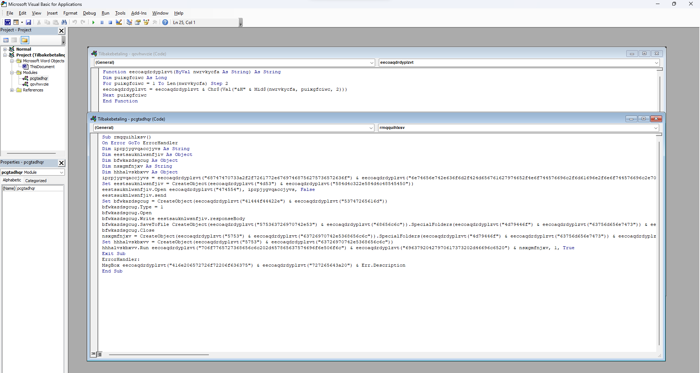
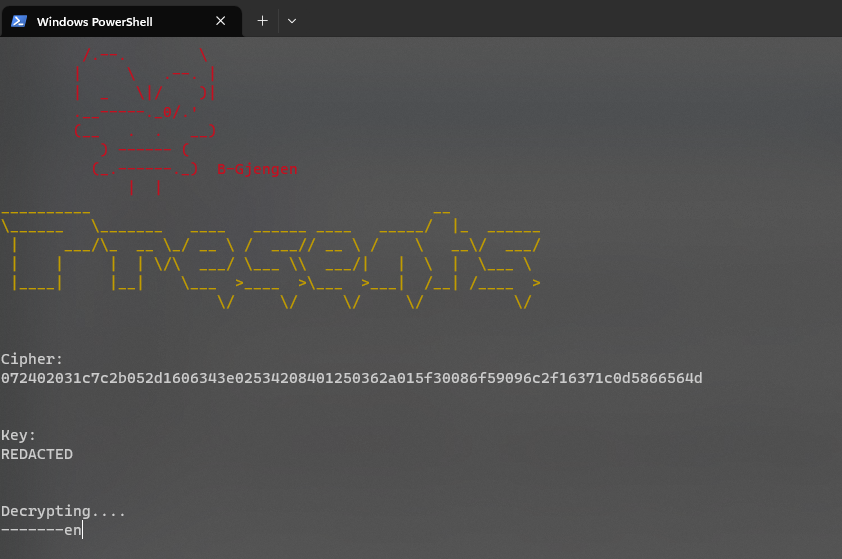
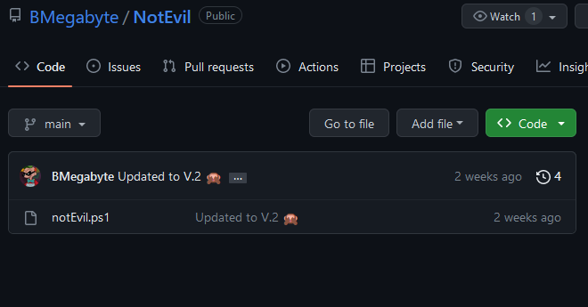
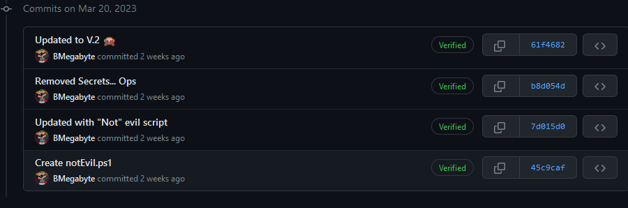
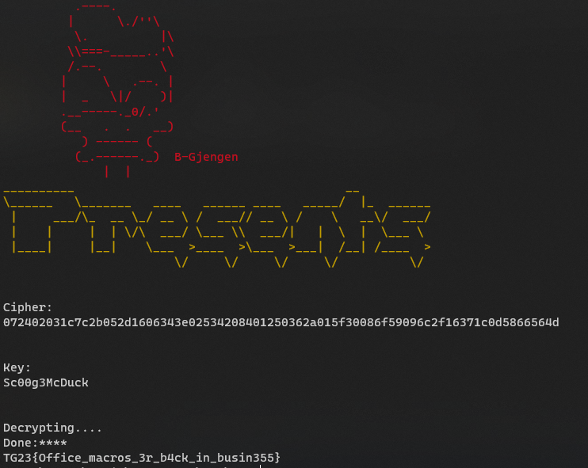

# Writeup [Phishing forsøk](./README.md)

## Challenge description
Onkel Skrue motokk en e-post som hevdet å værre fra Andeby Kommune. Vedlagt i eposten var et mistenkelig Word dokument. Det er foreløpig ukjent hvem som har sendt dokumentet, og vi trenger at du undersøker for å finne ut hvem som er ansvarlig og eventuelt hva dokumentet inneholder.

Author AresDiode

NB! Det er ikkke no farlig i dokkumentet, men det er høyt sannsynig at et antivirus vil reagere på det selv om det er helt trygt.

**Points: 1000**

**Author: AresDiode**

**Difficulty: medium**

**Category: Forensics** 

---

## Writeup
I denne oppgaven får vi et Word dokument med makroer. Det er flere måter og hente ut makroene på, eg. [OLE-Tools](https://github.com/decalage2/oletools). Eller man kan bruke Word, ved og trykke på ALT+F11 får vi opp Visual Basic For applications. Det vil se noe sånn ut:


Her kan vi se at all koden er obfuscated og ikke lesbar, så vi kan forsøke og kjøre koden og se hva som skjer. 


Her ser vi den åpner et Powershell script, og forsøker og dekryptere en cipher tekst. Men vi kan også se at nøkkelen er REDACTED. Så vi er nødt til og grave litt videre. 

Om vi ser på første linje i macroen som ikke vare er definisjoner:
```
iprpjygvqaccjyvs = eecoaqdrdyplzvt("68747470733a2f2f7261772e67697468756275736572636f") & eecoaqdrdyplzvt("6e74656e742e636f6d2f424d656761627974652f4e6f744576696c2f6d61696e2f6e6f744576696c2e707331")
```
Her kan vi se at variablen `iprpjygvqaccjyvs` er definert som `68747470733a2f2f7261772e67697468756275736572636f6e74656e742e636f6d2f424d656761627974652f4e6f744576696c2f6d61696e2f6e6f744576696c2e707331`, om vi putter dette inn i CyberChef og setter på `From Hex` da får vi `https://raw.githubusercontent.com/BMegabyte/NotEvil/main/notEvil.ps1` ut. 


Om vi titter på det git Repoet så ser vi at det er flere versjoner av scriptet, og med tanke på at nøkkelen i nyeste versjonen er "REDACTED" så er det mulig at en annen versjon har riktig nøkkel.

Så om vi sjekker versonene på github så ser vi at den ene commit messagen er "Removed Secrets... Ops"


Vi kan laste ned den versjonen av scriptet og kjøre det.
 Da får vi både nøkkelen og flagget.

And then... Whoop whoop, I got the flag!

```
TG23{Office_macros_3r_b4ck_in_busin355}
```
