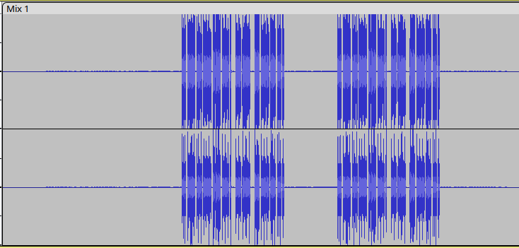

# Writeup [Musikk med DJ Donald](./README.md)

## Challenge description
Donald har begynt i sin nye jobb som musikkprodusent og tjener gode penger på det, men en dag fant Donald et spøkelsestrack i sin kule tune etter å ha blitt forstyrret av Ole, Dole og Doffen som kastet møkk på veggene. Hva kan det være? Donald eksporterte en tidligere versjon bare minutter før det skjedde. Kan du finne ut hva det er?

Flaggformat: TG23{Tekst_med_understreker}

**Points: 1000**

**Author(s): Isoporhode, AresDiode**

**Difficulty: easy/mid**

**Category: Misc** 

---

## Writeup
Her får man 2 lydfiler, om man hører igjennom etter, er det noe rart bråk som kommer, som er hintet til i oppgave teksten.

For og finne ut hva som er endret kan man inverse `Før.wav` og kombinere den med `Etter.wav`. Da ender man opp med noe sånn:
 

Her kan vi se at det er noe som kan minne om morse? Om vi prøver og dekoder det så får vi:
```
... -.-. .-. --- --- --. . / -- -.-. / -- --- .-. ... .
```

Om vi dekoder dette så får vi: SCROOGE MC MORSE
And then... Whoop whoop, I got the flag!

```
TG23{scrooge_mc_morse}
```
