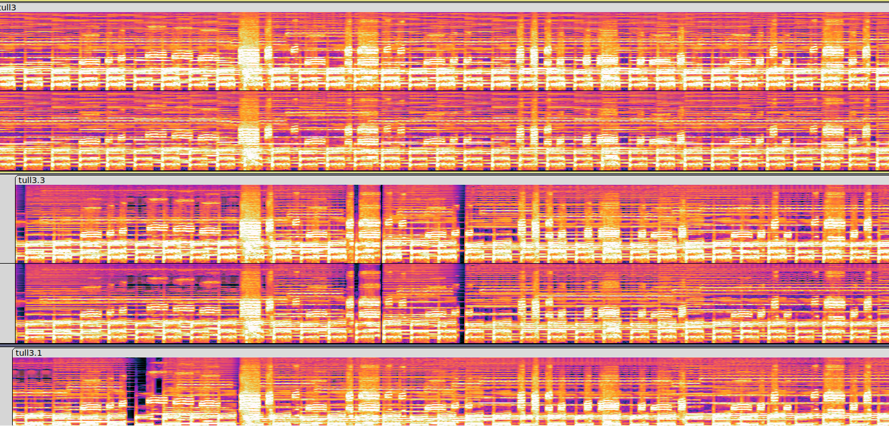
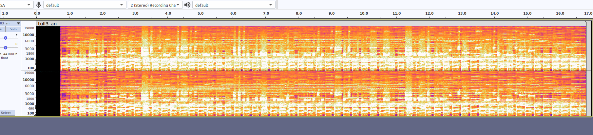

# Writeup [Fancy task name](./README.md)

## Challenge description
Å nei det skjedde igjen! Men denne gangen lagret ikke Donald første versjon. Donald viste sangen til Onkel Skrue for kanskje han er gammel nok til å skjønne hva som foregår. Etter onkel Skrue hørte på sangen et par ganger mens han skrev noen bokstaver, begynte han å le og sa "Jeg er enig". Hva skjønte Onkel Skrue?

Flagformat: TG23{Tekst_med_understreker}

**Points: 1000**

**Author(s): Isoporhode, AresDiode**

**Difficulty: Pain**

**Category: Misc** 

---

## Writeup

Oppgaven er løsbar med å kun høre på det rare signalet i filen, eller og se nøye etter i spektogrammet.


Det er også mulig å layere de fire gangene signalet er brukt på hverandre slik at deler av sangen i bunnen kansje kansellerer seg selv ut. Derretter kan man igjen analysere morse ut fra det og finne flagget.



And then... Whoop whoop, I got the flag!

```
TG23{Donald_har_blitt_crazy}
```
